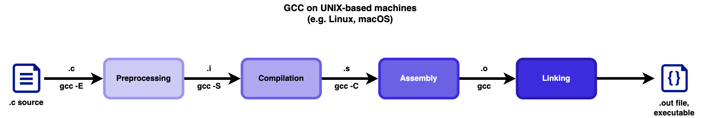

# Structure of a simple C program  
  
## Basic structure  
  
1. **Preprocessor Directives**: Include necessary header files.  
```c  
#include <stdio.h>  
```
  
2. **Main Function**: The entry point of the program.  
  
3. **Function Definitions**: Any additional functions called from `main`.  
  
## Different ways to define `main`  
  
1. **`int main(void)`**:  
    - No parameters.  
    - Use when no command-line arguments are needed.
  
2. **`int main(int argc)`**:  
    - Single parameter `argc` (argument count).  
  
3. **`int main(int argc, char *argv[])`**:  
    - Two parameters: `argc` (argument count) and `argv` (argument vector).  
    - Common for processing command-line arguments.  
  
4. **`int main(int argc, char *argv[], char *envp[])`**:  
    - Three parameters: `argc`, `argv`, and `envp` (environment pointers).  
    - Useful for accessing environment variables.

# How to write header files for your project

## Steps to write `.h` and `.c` files  

1. Write the Header File (`.h`)  
  
- **Purpose**: Contains declarations of functions or global variables
- **Example**: `utils.h`  
```c  
#ifndef UTILS_H  // HEADER GUARD -> preprocessor directive
#define UTILS_H

// global vars
// function declarations

#endif
```  
  
2. Write the source file (`.c`) that contains the actual implementations of the functions declared in the header file. 
  
3. Use the `.h` header in another `.c` source using `#include "utils.h`

4. Compile both sources together:
```bash
gcc -c utils.c -o utils.o
gcc app.c utils.o -o app.out
```
OR directly
```bash
gcc app.c utils.c -o app.out
```
  
## Header Guards  
  
- **Purpose**: Prevents multiple inclusions of the same header file, avoiding errors.  
- **How It Works**:  
```c  
#ifndef UTILS_H // <-- checks if UTILS_H was previously defined
#define UTILS_H // <-- if it was not defined, define it and the code
                //     between here and #endif will be included

// declarations

#endif
```


# GCC Compiling Flow  



The GCC (GNU Compiler Collection) compiling process consists of four main steps: preprocessing, compilation, assembly, and linking. Each step transforms the source code, eventually producing an executable program.  
  
#### 1. Preprocessing  
- **Input**: Source code file (`.c`)  
- **Output**: Preprocessed source file (`.i`)  
- **Command**: `gcc -E file.c -o file.i`  
  
The preprocessor handles directives such as `#include` and `#define`, and outputs the preprocessed code.  
  
#### 2. Compilation  
- **Input**: Preprocessed source file (`.i`)  
- **Output**: Assembly code file (`.s`)  
- **Command**: `gcc -S file.i -o file.s`  
  
The compiler translates the preprocessed source code into assembly code.  
  
#### 3. Assembly  
- **Input**: Assembly code file (`.s`)  
- **Output**: Object file (`.o`)  
- **Command**: `gcc -c file.s -o file.o`  
  
The assembler converts the assembly code into machine code, producing an object file.  
  
#### 4. Linking  
- **Input**: Object file(s) (`.o`)  
- **Output**: Executable file (usually with no extension, or `.out` on Unix-like systems)  
- **Command**: `gcc file.o -o executable`  
  
The linker combines object files and libraries to produce the final executable.  
  
#### Full Compilation Command  
  
To compile a C program in one step, you can use:  
```sh  
gcc file.c -o executable_name
```

### Linking Types:

**Static Linking:** The code of both sources is injected directly into the executable.
*Example:* `gcc app.c hello.c -o app.out`
*Explanation:* These files will be put together in the executable file.

**Dynamic Linking:** The library is loaded at runtime, allowing the same code to be used by multiple processes at once (e.g., libc, math library).
*Example:* `gcc app.c -lm -o app.out`
*Explanation:* Code from `math.h` won't be present in the executable file, during the linking process there will be some placeholders in the binary that will be resolved at runtime.

# Introduction to Makefile  
  
A Makefile is a special file used in software development to manage the build process of a project.
It is used by the `make` utility, a build automation tool that automatically compiles and links programs.
  
### What is a Makefile and make?  
- **Makefile**: A text file containing a set of directives used by the `make` build automation tool to compile and link a program.  
- **Make**: A command-line tool that reads the Makefile and executes the specified tasks to build your project.
  
### How does it help automate tasks?  
- **Dependencies**: Makefile specifies which files depend on which others. If a file changes, `make` knows which other files need to be recompiled.

- **Targets and Rules**: You define "targets" (e.g., executable files) and "rules" (commands to build these targets). `make` uses these to automate the process.
