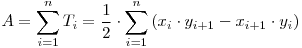

# Fișiere🕳️

**Înainte de a rezolva exercițiile, citiți [textul laboratorului](https://ocw.cs.pub.ro/courses/programare/laboratoare/lab12).**

**TOATE EXERCIȚIILE SE SALVEAZĂ ÎNTR-UN SINGUR FIȘIER `lab11.c`**

### EASY

1.
**a)** Scrieți o structură `Point` care să conțină două câmpuri de tip întreg: `x` și `y`.

**b)** Scrieți o structură `Polygon` care să conțină un câmp de tip `int` care reprezintă numărul de vârfuri ale poligonului și un vector de `Point`-uri static de maxim 32 de vârfuri care reprezintă vârfurile poligonului. (fix în această ordine)

2.
Creați un fișier TEXT din care să citiți programatic mai multe poligoane. Formatul fișierului (ordinea datelor în fișier) rămâne la alegerea voastră. Poligoanele citite trebuie să fie alocate dinamic.

### MEDIUM

3.
Scrieți o funcție care translatează un poligon cu o valoare dată pe axa x sau y.

4.
Scrieți o funcție care scrie într-un fișier BINAR toate poligoanele citite și translatate anterior.

5.
Scrieți o funcție care citește toate poligoanele din fișierul binar folosind o singură apelare de `fread` (sau două, că trebuie să citiți `n` prima dată).

### ADVANCED

6.
Scrieți o funcție care primește un poligon și întoarce aria acestuia folosind formula "signed area". Folosiți poligoanele citire din fișierul binar.
Referință: https://www.infoarena.ro/problema/aria

Practic, voi aveți toate vârfurile poligonului și trebuie să aplicați formula:

7.
Scrieți, într-un fișier text, următoarele informații:
- pe prima linie, numărul de poligoane
- pe următoarele linii, aria fiecărui poligon, cu 2 zecimale exacte.
- pe ultima linie, aria totală a tuturor poligoanelor, cu 2 zecimale exacte.

8. ❗️

Nu uitați să faceți `free` la memoria alocată dinamic dacă e cazul și să închideți fișierele deschise. 🙂🙃
